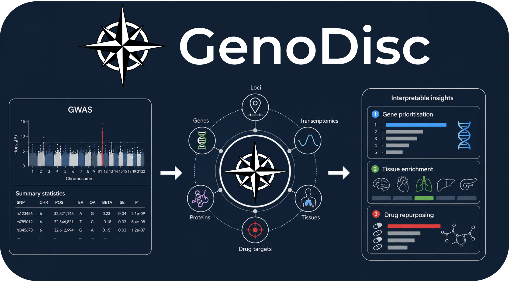

 

# What is GenoDisc?

GenoDisc is a research programme based at King’s College London that focuses on key issues relating to the clinical utility of polygenic scores, investigating polygenic scoring research questions, and developing tools that implement current best practises.

 

# The Pipeline

We have implemented a range of post-GWAS analyses into our GenoPred pipeline - An easy-to-use and robust software pipeline.

<a href="pipeline_guide.html" class="button">Learn More</a>

 

Please contact Oliver Pain (oliver.pain@kcl.ac.uk) for any questions or comments.

